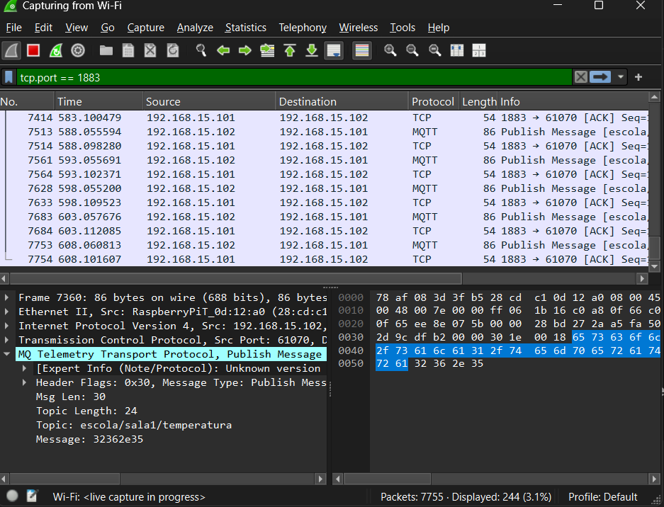
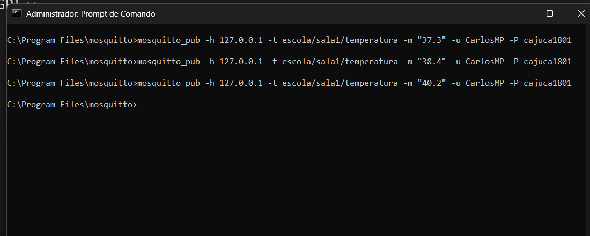
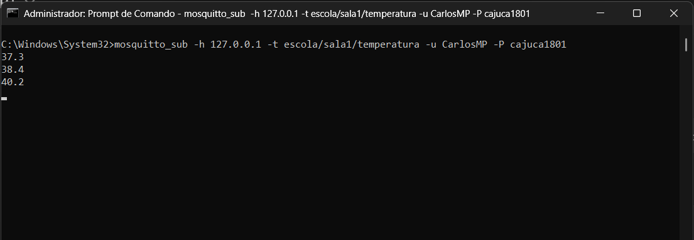
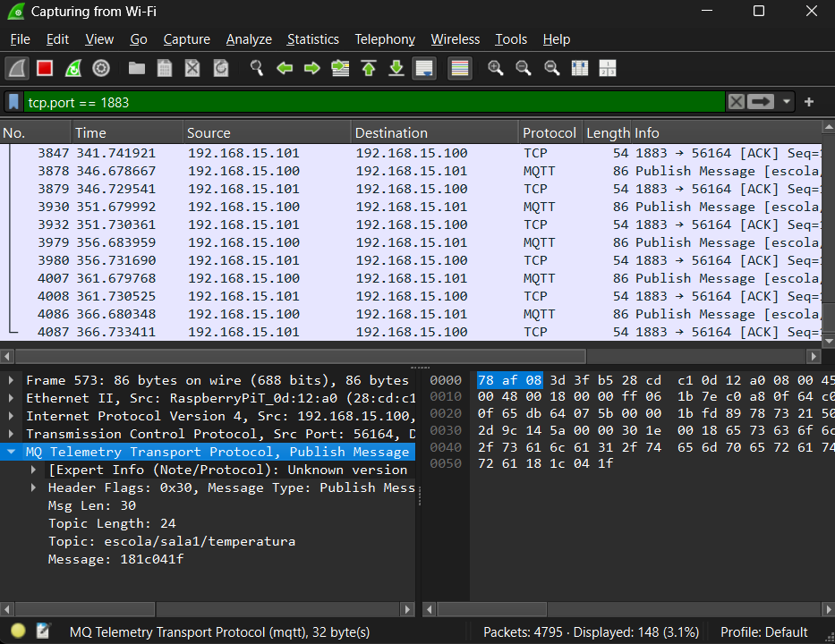
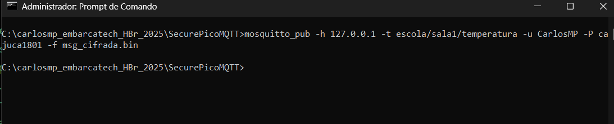
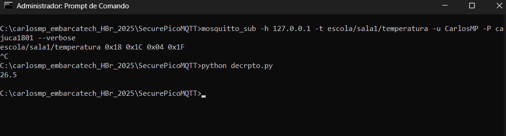

[](https://classroom.github.com/a/G8V_0Zaq)

# Tarefa: IoT Security Lab - EmbarcaTech 2025
---
Autores:
- **Adriana Rocha**  
- **Arthur Franco Neto**  
- **Carlos Martinez Perez**  
---
Curso: Residência Tecnológica em Sistemas Embarcados

Instituição: EmbarcaTech - HBr

Campinas, junho de 2025

---

# Projeto SecurePicoMQTT - Segurança em IoT na BitDogLab com MQTT

## Visão Geral

Este projeto implementa uma comunicação MQTT segura utilizando a placa **BitDogLab baseada no Raspberry Pi Pico W**, programada em C com o SDK do Pico e a pilha de rede lwIP. O objetivo é estabelecer uma conexão Wi-Fi, conectar-se a um broker MQTT (Mosquitto), publicar mensagens em tópicos específicos, implementar autenticação, aplicar criptografia leve com XOR e adicionar proteção contra ataques de sniffing e replay, atendendo aos requisitos da **Tarefa Unidade 2 - Parte 2** do programa **EMBARCATECH**.

---

## Objetivos

- **Conexão Wi-Fi**: Estabelecer conexão com uma rede Wi-Fi protegida usando autenticação WPA2.
- **Conexão MQTT**: Conectar a placa ao broker Mosquitto com autenticação de usuário e senha.
- **Publicação de Mensagens**: Enviar mensagens em texto claro e criptografadas no tópico `escola/sala1/temperatura` e outros.
- **Criptografia Leve**: Implementar ofuscação com cifra XOR (chave 42) para proteger contra sniffing básico.
- **Proteção contra Replay**: Adicionar timestamp às mensagens para evitar ataques de repetição.
- **Diagnóstico de Rede**: Utilizar Wireshark para monitoramento e análise de tráfego, com solução de problemas de firewall.

---

## Introdução

- O que é MQTT?  
  MQTT (Message Queuing Telemetry Transport) é um protocolo de comunicação leve e eficiente, projetado para conectar dispositivos em redes com pouca largura de banda, latência alta ou conectividade intermitente — exatamente o tipo de ambiente encontrado em aplicações de Internet das Coisas (IoT).
  O MQTT segue o modelo publish/subscribe (publicação/assinatura), no qual os dispositivos podem atuar como:

  - Publicadores (publishers): enviam mensagens sobre determinado tópico (ex: "sensor/temperatura").

  - Subscritores (subscribers): recebem as mensagens dos tópicos que assinaram.

  Esse modelo desacopla os emissores e receptores — ou seja, eles não precisam conhecer a existência um do outro, o que facilita muito a escalabilidade e flexibilidade de sistemas IoT com dezenas ou centenas de dispositivos distribuídos.

- O que é um broker MQTT?  
  O broker é o servidor que faz o papel de intermediário: ele recebe mensagens dos publicadores e distribui para todos os subscritores interessados. Ele garante a entrega correta, eficiente e (em níveis mais avançados) confiável das mensagens.

- O que é o Mosquitto?  
  Mosquitto é uma implementação leve e de código aberto de um broker MQTT. Ele é amplamente usado em projetos de IoT por sua facilidade de uso, suporte a autenticação, criptografia e compatibilidade com diversas plataformas, incluindo sistemas embarcados como o Raspberry Pi Pico W.

## Materiais Necessários

- **Hardware**:
  - Placa BitDogLab com Raspberry Pi Pico W
- **Software**:
  - Visual Studio Code com extensões CMake e Pico SDK
  - Mosquitto (broker MQTT) configurado no sistema
  - Wireshark para análise de tráfego
  - SDK do Raspberry Pi Pico
  - Biblioteca lwIP para MQTT
- **Rede**:
  - Rede Wi-Fi protegida com WPA2 (SSID e senha fornecidos)

---

## Estrutura do Projeto

```
SecurePicoMQTT/
├── CMakeLists.txt
├── main.c
├──src/display_oled.c
├──include/display_oled.h
├──src/mqtt_comm.c
├── include/mqtt_comm.h
├──src/mqtt_publisher.c
├──include/mqtt_publisher.h
├──src/mqtt_subscriber.c
├──include/mqtt_subscriber.h
├──src/tratar_gpio.c
├──include/tratar_gpio.h
├── src/wifi_conn.c
├── include/wifi_conn.h
├── src/xor_cipher.c
├── include/xor_cipher.h
├──oled/ssd1306_font.h
├──oled/ssd1306_i2c.c
├──oled/ssd1306_i2c.h
├──oled/ssd1306.h
├──.gitignore
├──mosq_pub.py
├── lwipopts.h
├── pico_sdk_import.cmake
└── README.md
```

---

## Etapas de Implementação

### Etapa 1: Conexão Wi-Fi

- **Objetivo**: Conectar a Pico W a uma rede Wi-Fi usando autenticação WPA2.
- **Implementação**:
  - Arquivos: `main.c`, `wifi_conn.c`, `wifi_conn.h`.
  - Código bloquenate (só libera após conectado) que configura o chip CYW43 para modo estação (STA) e tenta conexão com timeout de 30 segundos.

#### Código

- main.c:

```c
#include "include/wifi_conn.h"
#include "pico/stdlib.h"
#include <stdio.h>

int main() {
    // Inicializa a biblioteca padrão do Pico (necessária para GPIO, UART, etc.)
    stdio_init_all();
    sleep_ms(2000); // Tempo para abrir o monitor serial

    // Credenciais da rede Wi-Fi (substitua pelos valores reais)
    const char *ssid = "minha-rede-wifi";
    const char *password = "minha-senha-rede-wifi";

    // Chama a função para conectar ao Wi-Fi
    connect_to_wifi(ssid, password);

    // Loop principal para manter o programa em execução
    while (true) {
        // Adicione aqui futuras funcionalidades (ex.: MQTT, autenticação, criptografia)
        sleep_ms(1000); // Aguarda 1 segundo para evitar consumo excessivo de CPU
    }

    return 0;
}
```

- wifi_conn.c:

````c
#include "include/wifi_conn.h"         // Cabeçalho com a declaração da função de conexão Wi-Fi
#include "pico/cyw43_arch.h"           // Biblioteca para controle do chip Wi-Fi CYW43 no Raspberry Pi Pico W
#include <stdio.h>                     // Biblioteca padrão de entrada/saída (para usar printf)

/**
 * Função: connect_to_wifi
 * Objetivo: Inicializar o chip Wi-Fi da Pico W e conectar a uma rede usando SSID e senha fornecidos.
 */
void connect_to_wifi(const char *ssid, const char *password) {
    // Inicializa o driver Wi-Fi (CYW43). Retorna 0 se for bem-sucedido.
    if (cyw43_arch_init()) {
        printf("Erro ao iniciar Wi-Fi\n");
        return;
    }

    // Habilita o modo estação (STA) para se conectar a um ponto de acesso.
    cyw43_arch_enable_sta_mode();

    // Tenta conectar à rede Wi-Fi com um tempo limite de 30 segundos (30000 ms).
    // Utiliza autenticação WPA2 com criptografia AES.
    if (cyw43_arch_wifi_connect_timeout_ms(ssid, password, CYW43_AUTH_WPA2_AES_PSK, 30000)) {
        printf("Erro ao conectar\n");  // Se falhar, imprime mensagem de erro.
    } else {
        printf("Conectado ao Wi-Fi\n");  // Se conectar com sucesso, exibe confirmação.
    }
}

- wifi_conn.h:
```c
#ifndef WIFI_CONN_H
#define WIFI_CONN_H

void connect_to_wifi(const char *ssid, const char *password);

#endif
````

#### Resultado

- Conexão bem-sucedida, confirmada no monitor serial:
  ```text
  ---- Opened the serial port COM4 ----
  Conectado ao Wi-Fi
  ```

---

### Etapa 2: Configuração MQTT Básica

- **Objetivo**: Estabelecer conexão com o broker Mosquitto e publicar mensagens no tópico `test/topic`.
- **Implementação**:
  - Arquivos adicionados: `main.c`, `mqtt_comm.c`, `mqtt_comm.h`, `lwipopts.h` modificado.
  - Configuração do broker com autenticação (usuário: `aluno`, senha: `senha123`).
  - Solução de problema: Firewall do Windows bloqueava pacotes MQTT na porta 1883. Solucionado com a execução do Wireshark com filtro `tcp.port == 1883, após inicializar o broker mosquitt, impedindo que o Windoes bloqueie pacotes silenciosamente. O Wireshark, ao ativar o modo promíscuo, força a rede a escutar pacotes externos, o que acaba desbloqueando a comunicação com a Pico W.

#### Código

- main.c:
```c
#include "include/wifi_conn.h"
#include "include/mqtt_comm.h"
#include "pico/stdlib.h"
#include <stdio.h>
#include <string.h>

int main() {
    // Inicializa a biblioteca padrão do Pico (necessária para GPIO, UART, etc.)
    stdio_init_all();

    // Aguarda inicialização do USB para depuração (opcional, dá tempo para o console conectar)
    sleep_ms(5000);

    // Credenciais da rede Wi-Fi (substitua pelos valores reais)
    const char *ssid = "minha-rede-wifi";
    const char *password = "minha-senha-rede-wifi";

    // Conectar ao Wi-Fi
    connect_to_wifi(ssid, password);

    // Aguarda a conexão Wi-Fi estabilizar
    sleep_ms(2000);

    // Configurações do broker MQTT
    const char *client_id = "pico_client";
    const char *broker_ip = "127.0.0.1"; // Substitua pelo IP do broker (localhost para testes locais)
    const char *user = "aluno"; // Substitua pelo usuário configurado no Mosquitto
    const char *pass = "senha123"; // Substitua pela senha configurada no Mosquitto

    // Configura e conecta ao broker MQTT
    mqtt_setup(client_id, broker_ip, user, pass);

    // Aguarda a conexão MQTT (dá tempo para o callback confirmar)
    sleep_ms(2000);

    // Loop principal para publicar mensagens de teste
    while (true) {
        // Mensagem de teste
        const char *message = "Hello, MQTT!";
        const char *topic = "test/topic";

        // Publica a mensagem no tópico
        mqtt_comm_publish(topic, (const uint8_t *)message, strlen(message));

        // Aguarda 5 segundos antes de publicar novamente
        sleep_ms(5000);
    }

    return 0;
}
```

- mqtt_comm.c:
```c
#include "lwip/apps/mqtt.h"       // Biblioteca MQTT do lwIP
#include "include/mqtt_comm.h"    // Header file com as declarações locais
// Base: https://github.com/BitDogLab/BitDogLab-C/blob/main/wifi_button_and_led/lwipopts.h
#include "lwipopts.h"             // Configurações customizadas do lwIP

/* Variável global estática para armazenar a instância do cliente MQTT
 * 'static' limita o escopo deste arquivo */
static mqtt_client_t *client;

/* Callback de conexão MQTT - chamado quando o status da conexão muda
 * Parâmetros:
 *   - client: instância do cliente MQTT
 *   - arg: argumento opcional (não usado aqui)
 *   - status: resultado da tentativa de conexão */
static void mqtt_connection_cb(mqtt_client_t *client, void *arg, mqtt_connection_status_t status) {
    if (status == MQTT_CONNECT_ACCEPTED) {
        printf("Conectado ao broker MQTT com sucesso!\n");
    } else {
        printf("Falha ao conectar ao broker, código: %d\n", status);
    }
}

/* Função para configurar e iniciar a conexão MQTT
 * Parâmetros:
 *   - client_id: identificador único para este cliente
 *   - broker_ip: endereço IP do broker como string (ex: "192.168.1.1")
 *   - user: nome de usuário para autenticação (pode ser NULL)
 *   - pass: senha para autenticação (pode ser NULL) */
void mqtt_setup(const char *client_id, const char *broker_ip, const char *user, const char *pass) {
    ip_addr_t broker_addr;  // Estrutura para armazenar o IP do broker

    // Converte o IP de string para formato numérico
    if (!ip4addr_aton(broker_ip, &broker_addr)) {
        printf("Erro no IP\n");
        return;
    }

    // Cria uma nova instância do cliente MQTT
    client = mqtt_client_new();
    if (client == NULL) {
        printf("Falha ao criar o cliente MQTT\n");
        return;
    }

    // Configura as informações de conexão do cliente
    struct mqtt_connect_client_info_t ci = {
        .client_id = client_id,  // ID do cliente
        .client_user = user,     // Usuário (opcional)
        .client_pass = pass      // Senha (opcional)
    };

    // Inicia a conexão com o broker
    // Parâmetros:
    //   - client: instância do cliente
    //   - &broker_addr: endereço do broker
    //   - 1883: porta padrão MQTT
    //   - mqtt_connection_cb: callback de status
    //   - NULL: argumento opcional para o callback
    //   - &ci: informações de conexão
    mqtt_client_connect(client, &broker_addr, 1883, mqtt_connection_cb, NULL, &ci);
}

/* Callback de confirmação de publicação
 * Chamado quando o broker confirma recebimento da mensagem (para QoS > 0)
 * Parâmetros:
 *   - arg: argumento opcional
 *   - result: código de resultado da operação */
static void mqtt_pub_request_cb(void *arg, err_t result) {
    if (result == ERR_OK) {
        printf("Publicação MQTT enviada com sucesso!\n");
    } else {
        printf("Erro ao publicar via MQTT: %d\n", result);
    }
}

/* Função para publicar dados em um tópico MQTT
 * Parâmetros:
 *   - topic: nome do tópico (ex: "sensor/temperatura")
 *   - data: payload da mensagem (bytes)
 *   - len: tamanho do payload */
void mqtt_comm_publish(const char *topic, const uint8_t *data, size_t len) {
    // Envia a mensagem MQTT
    err_t status = mqtt_publish(
        client,              // Instância do cliente
        topic,               // Tópico de publicação
        data,                // Dados a serem enviados
        len,                 // Tamanho dos dados
        0,                   // QoS 0 (nenhuma confirmação)
        0,                   // Não reter mensagem
        mqtt_pub_request_cb, // Callback de confirmação
        NULL                 // Argumento para o callback
    );

    if (status != ERR_OK) {
        printf("mqtt_publish falhou ao ser enviada: %d\n", status);
    }
}
```

- mqtt_comm.h:
```c
#ifndef MQTT_COMM_H
#define MQTT_COMM_H

#include "lwip/apps/mqtt.h"

/**
 * Função: mqtt_setup
 * Objetivo: Configurar e iniciar a conexão com o broker MQTT.
 * Parâmetros:
 *   - client_id: Identificador único do cliente
 *   - broker_ip: Endereço IP do broker (ex.: "192.168.1.1")
 *   - user: Nome de usuário para autenticação (pode ser NULL)
 *   - pass: Senha para autenticação (pode ser NULL)
 */
void mqtt_setup(const char *client_id, const char *broker_ip, const char *user, const char *pass);

/**
 * Função: mqtt_comm_publish
 * Objetivo: Publicar dados em um tópico MQTT.
 * Parâmetros:
 *   - topic: Nome do tópico (ex.: "sensor/temperatura")
 *   - data: Payload da mensagem (bytes)
 *   - len: Tamanho do payload
 */
void mqtt_comm_publish(const char *topic, const uint8_t *data, size_t len);

#endif
```

- modificações em lwipopts.h:
```c
#define MEMP_NUM_SYS_TIMEOUT   (LWIP_NUM_SYS_TIMEOUT_INTERNAL + 1)
#define MQTT_REQ_MAX_IN_FLIGHT  (5)
```

#### Resultado

- Antes de executar Wireshark, no monitor serial da IDE VS Code:
  ```text
  Aguardando conexão MQTT...
  Falha ao conectar ao broker MQTT. Abortando.
  ````

- Após a execução do Wireshark:
  ```text
  ---- Opened the serial port COM4 ----
  Conectado ao Wi-Fi
  Conectado ao broker MQTT com sucesso!
  Publicação MQTT enviada com sucesso!
  Publicação MQTT enviada com sucesso!
  Publicação MQTT enviada com sucesso!
  Publicação MQTT enviada com sucesso!
  Publicação MQTT enviada com sucesso!
  ```


- Log do Mosquitto:
  ```
  New client connected from 192.168.15.102 as pico_client
  Received PUBLISH from pico_client on topic test/topic
  ```

---

### Etapa 3: Publicação em Texto Claro

- **Objetivo**: Publicação Sem Segurança: Validada pela visualização da mensagem em texto claro `"26.5"` no tópico `escola/sala1/temperatura`no terminal do mosquitto_sub e, criticamente, no payload do pacote MQTT no Wireshark, confirmando a ausência de ofuscação.
- **Implementação**:
  - Substituição no `main.c`:
    ```c
    const char *message = "26.5";
    const char *topic = "escola/sala1/temperatura";
    ```
#### Resultado

- Mensagem capturada no Wireshark em texto claro (`32362e35` em ASCII hexadecimal, decodificado como `"26.5"`).
- Log do Mosquitto:
  ```text
  C:\Program Files\mosquitto>mosquitto -c mosquitto.conf -v
  1748047143: mosquitto version 2.0.21 starting
  1748047143: Config loaded from mosquitto.conf.
  1748047143: Opening ipv6 listen socket on port 1883.
  1748047143: Opening ipv4 listen socket on port 1883.
  1748047143: mosquitto version 2.0.21 running
  1748047446: New connection from 192.168.15.102:61070 on port 1883.
  1748047446: New client connected from 192.168.15.102:61070 as pico_client (p2, c1, k0, u'aluno').
  1748047446: No will message specified.
  1748047446: Sending CONNACK to pico_client (0, 0)
  1748047447: Received PUBLISH from pico_client (d0, q0, r0, m0, 'escola/sala1/temperatura', ... (4 bytes))
  1748047452: Received PUBLISH from pico_client (d0, q0, r0, m0, 'escola/sala1/temperatura', ... (4 bytes))```
  ```

- Captura filtrada no Wireshark:  

  
*Figura 1 - Tela do Wireshark.*

- A imagem mostra a publicação da mensagem `"26.5"` no tópico `escola/sala1/temperatura` através do protocolo MQTT (porta 1883), conforme capturado pelo Wireshark.
  - A mensagem foi enviada em texto claro (sem criptografia).
  - É possível visualizar no campo **Message** o conteúdo `32362e35`, que corresponde a `"26.5"` em ASCII hexadecimal.
  - Essa etapa valida a comunicação MQTT básica da Pico W com o broker Mosquitto, com conteúdo visível no tráfego de rede.
  - Decodificação hexadecimal da mensagem `32362e35`:

| Hex  | ASCII |
|------|-------|
| 32   | 2     |
| 36   | 6     |
| 2e   | .     |
| 35   | 5     |

---

### Etapa 4: Autenticação no Mosquitto

- **Objetivo**: Autenticação Básica, Verificada pela rejeição de conexões de mosquitto_sub sem credenciais e pela aceitação de conexões com usuário e senha corretos, conforme logs do Mosquitto broker. A placa BitDogLab só consegue se conectar ao broker com as credenciais configuradas.
- **Implementação**:
  - Configuração do `mosquitto.conf`:
    ```conf
    listener 1883
    allow_anonymous false
    password_file C:\caminho\para\passwd
    ```
  - Criação de senha:
    ```text
    mosquitto_passwd -c C:\caminho\para\passwd aluno
    (e posterior digitação de senha123 duas vezes).
    ```
  - Testes com `mosquitto_pub` e `mosquitto_sub` confirmaram funcionamento. Comandos emitidos em terminais CMD diferentes:
    ```text
    mosquitto_pub -h 192.168.15.101 -p 1883 -t escola/sala1/temperatura -u aluno -P senha123 -m "26.5"

    mosquitto_sub -h 192.168.15.101 -p 1883 -t escola/sala1/temperatura -u aluno -P senha123 --verbose
    ```

📤 Publicação das mensagens via terminal:  
  
*Figura 2 - Publicação com mosquitto-pub.*

Assinatura e recepção das mensagens com `mosquitto_sub`:  
  
*Figura 3 - Recepção com mosquitto-sub.*

#### Resultado

  - Publicações manuais de `"37.3"`, `"38.4"`, `"40.2"` no tópico `escola/sala1/temperatura` foram recebidas corretamente.

---

### Etapa 5: Criptografia com XOR

- **Objetivo**: Criptografia Leve XOR, confirmada pela exibição de dados ofuscados (bytes hexadecimais) no payload do Wireshark  e pela capacidade do próprio Pico W (atuando como subscriber) de decifrar a mensagem e exibir o texto original no seu monitor serial.
- **Implementação**:
  - Arquivos adicionados: `xor_cipher.c`, `xor_cipher.h`

#### Código

- main.c:
```c
#include "pico/stdlib.h"
#include "pico/cyw43_arch.h"
#include "include/wifi_conn.h"
#include "include/mqtt_comm.h"
#include "include/xor_cipher.h"
#include <stdio.h>
#include <string.h>

#define WIFI_SSID       "VIVOFIBRA-8991_EXT"
#define WIFI_PASS       "cajuca1801"
#define MQTT_BROKER_IP  "192.168.15.101"
#define MQTT_USER       "CarlosMP"
#define MQTT_PASS       "cajuca1801"
#define MQTT_TOPIC      "test/topic"
#define XOR_KEY         42

int main() {
  stdio_init_all();
  sleep_ms(3000);  // Tempo para iniciar o terminal

  printf("Conectando ao Wi-Fi...\n");
  connect_to_wifi(WIFI_SSID, WIFI_PASS);
  printf("Conectado ao Wi-Fi.\n");

  printf("Conectando ao broker MQTT...\n");
  mqtt_setup("pico_pub", MQTT_BROKER_IP, MQTT_USER, MQTT_PASS);
  printf("Conectado ao broker MQTT.\n");

  const char* mensagem_clara = "26.5";
  char mensagem_cript[32];

  while (true) {
    xor_encrypt((const uint8_t*)mensagem_clara, (uint8_t*)mensagem_cript, strlen(mensagem_clara), XOR_KEY);
    mqtt_comm_publish(MQTT_TOPIC, (const uint8_t*)mensagem_cript, strlen(mensagem_clara));
    printf("Mensagem criptografada '%s' publicada com sucesso\n", mensagem_clara);

    sleep_ms(5000);  // Aguarda 5 segundos
  }

  return 0;
}
```

- xor_cipher.c:
```c
// Inclusão do arquivo de cabeçalho que contém a declaração da função
#include "include/xor_cipher.h"

/**
* Função para aplicar cifra XOR (criptografia/decifração)
* 
* @param input  Ponteiro para os dados de entrada (texto claro ou cifrado)
* @param output Ponteiro para armazenar o resultado (deve ter tamanho >= len)
* @param len    Tamanho dos dados em bytes
* @param key    Chave de 1 byte (0-255) para operação XOR
* 
* Funcionamento:
* - Aplica operação XOR bit-a-bit entre cada byte do input e a chave
* - XOR é reversível: mesma função para cifrar e decifrar
* - Criptografia fraca (apenas para fins didáticos ou ofuscação básica)
*/
void xor_encrypt(const uint8_t *input, uint8_t *output, size_t len, uint8_t key) {
    // Loop por todos os bytes dos dados de entrada
    for (size_t i = 0; i < len; ++i) {
        // Operação XOR entre o byte atual e a chave
        // Armazena resultado no buffer de saída
        output[i] = input[i] ^ key;
    }
}
```

- xor_cipher.h:
```c
#ifndef XOR_CIPHER_H
#define XOR_CIPHER_H

#include <stdint.h>
#include <stddef.h>

/**
* @brief Aplica uma cifra XOR simples para criptografar ou descriptografar dados.
*
* Esta função realiza uma operação XOR byte a byte entre os dados de entrada
* e uma chave de 1 byte. Por ser uma operação reversível, a mesma função pode
* ser usada tanto para cifrar quanto para decifrar os dados.
*
* @param input   Ponteiro para os dados de entrada (texto claro ou cifrado).
* @param output  Ponteiro para o buffer de saída (deve ter pelo menos 'len' bytes).
* @param len     Tamanho dos dados em bytes.
* @param key     Chave de 1 byte (valor entre 0 e 255).
*/
void xor_encrypt(const uint8_t *input, uint8_t *output, size_t len, uint8_t key);

#endif
```

#### Resultado

Monitor serial sem alteração.

MQTT:
C:\Program Files\mosquitto>mosquitto -c mosquitto.conf -v
1748124916: mosquitto version 2.0.21 starting
1748124916: Config loaded from mosquitto.conf.
1748124916: Opening ipv6 listen socket on port 1883.
1748124916: Opening ipv4 listen socket on port 1883.
1748124916: mosquitto version 2.0.21 running
1748126955: New connection from 192.168.15.100:56164 on port 1883.
1748126955: New client connected from 192.168.15.100:56164 as pico_client (p2, c1, k0, u'CarlosMP').
1748126955: No will message specified.
1748126955: Sending CONNACK to pico_client (0, 0)
1748126957: Received PUBLISH from pico_client (d0, q0, r0, m0, 'escola/sala1/temperatura', ... (4 bytes))
1748126962: Received PUBLISH from pico_client (d0, q0, r0, m0, 'escola/sala1/temperatura', ... (4 bytes))
1748126967: Received PUBLISH from pico_client (d0, q0, r0, m0, 'escola/sala1/temperatura', ... (4 bytes))
1748126972: Received PUBLISH from pico_client (d0, q0, r0, m0, 'escola/sala1/temperatura', ... (4 bytes))
1748126977: Received PUBLISH from pico_client (d0, q0, r0, m0, 'escola/sala1/temperatura', ... (4 bytes))
1748126982: Received PUBLISH from pico_client (d0, q0, r0, m0, 'escola/sala1/temperatura', ... (4 bytes))
1748126987: Received PUBLISH from pico_client (d0, q0, r0, m0, 'escola/sala1/temperatura', ... (4 bytes))

Wireshark:
  
*Figura 4 - Tela do Wireshark.*

Decriptografia da mensagem capturada 181C041F:
Aplique XOR com 0x2A (42 decimal):
Byte cifrado	XOR com 0x2A	Resultado	ASCII
0x18	        0x2A	  0x32	'2'
0x1C        	0x2A	  0x36	'6'
0x04        	0x2A	  0x2E	'.'
0x1F        	0x2A	  0x35	'5'

Ou seja, exatamente a mensagem transmitida: 26.5.

- Com mosquitto-pub e mosquitto-sub:

- Comandos:
  - mosquitto_pub -h 127.0.0.1 -t escola/sala1/temperatura -u aluno -P senha123 -f msg_cifrada.bin

  - mosquitto_sub -h 192.168.15.101 -t escola/sala1/temperatura -u aluno -P senha123 --verbose

- Script python para decriptografar:
```python
msg = bytes([0x18, 0x1C, 0x04, 0x1F])
decifrada = bytes([b ^ 42 for b in msg])
print(decifrada.decode())  # Saída: 26.5
```

  
*Figura 5 - Publicação com mosquitto-pub.*

  
*Figura 6 - Recepção com mosquitto-sub.*

---

### Etapa 6: Proteção contra Replay

- **Objetivo**: Proteção Contra Replay, pela adição de timestamps às mensagens, evitando ataques de replay, demonstrado pela aceitação de mensagens com timestamps crescentes e pela rejeição explícita ("Replay detectado...") de mensagens com timestamps antigos ou repetidos, tanto os publicados pelo próprio Pico W quanto os simulados via mosquitto_pub.
- **Implementação**:
  - Timestamp gerado com `to_ms_since_boot(get_absolute_time())` (ex.: `396547116` ms ≈ 6 minutos e 36 segundos desde o boot).
  - Sugestão de formato legível: `T=26.5 t=396.5s`.

#### Código

O código desta etapa está publicado neste repositório.

#### Resultado

- **Conexão Wi-Fi**: Estabelecida com sucesso.
- **Conexão MQTT**: Funcionando com autenticação no broker Mosquitto.
- **Publicação**: Mensagens enviadas em texto claro e criptografadas com XOR.
- **Segurança**:
  - Autenticação implementada no Mosquitto.
  - Criptografia XOR aplicada, com mensagem ofuscada capturada no Wireshark.
  - Timestamp adicionado para proteção contra replay (pendente validação no subscriber).
- **Diagnóstico**: Problema de firewall resolvido com regra TCP na porta 1883. Wireshark foi essencial para identificar pacotes bloqueados, deixando a rede em modo promíscuo.

#### Funcionalidades

- Modos de Operação: Publisher e Subscriber
**Publisher**: Uma placa configurada como publisher simula a medição de temperatura e publica os dados em um tópico MQTT específico (ex.: escola/sala1/temperatura). A temperatura é gerada aleatoriamente (25.0°C a 29.9°C) para testes, mas pode ser adaptada para sensores reais.  

**Subscriber**: Uma placa configurada como subscriber se inscreve em tópicos MQTT (ex.: escola/# para todas as salas ou escola/sala1/temperatura para testes específicos) e exibe as temperaturas recebidas em um display OLED.  

Formato da mensagem: T=<temperatura> <timestamp> (ex.: T=26.5 12345678), criptografada com XOR antes do envio.

- Subscrição e Exibição de Dados
O subscriber recebe mensagens retidas e em tempo real, descriptografa o payload, e exibe no display OLED:  
Primeira linha: Temperatura (ex.: T=26.50).  
Segunda linha: Timestamp (ex.: Ts=12345678).  
Terceira linha: Tópico (ex.: escola/sala1/temperatura).  

Um LED verde (LED_VD) pisca uma vez ao receber uma mensagem válida, indicando atividade.  
O uso do tópico wildcard escola/# em produção permite monitorar temperaturas de múltiplas salas.  

- Criptografia Simples com XOR
As mensagens são criptografadas com um algoritmo XOR (chave fixa: XOR_KEY=42) antes da publicação e descriptografadas no subscriber.  
O payload é convertido para formato hexadecimal, garantindo compatibilidade com o protocolo MQTT.  
Embora funcional, a criptografia XOR é básica e pode ser substituída por AES ou TLS em produção para maior segurança.  

- Conectividade Wi-Fi e MQTT
A placa se conecta a uma rede Wi-Fi configurada (SSID e senha definidos em main.c) e ao broker MQTT (IP, usuário, e senha configuráveis).  
Suporte a reconexão automática com timeout de 10 segundos, exibindo erros no OLED (ex.: "MQTT ERRO: Timeout") se a conexão falhar.  
Integração com a biblioteca lwIP para comunicação MQTT eficiente em sistemas embarcados.  

- Interface com Display OLED
Um display OLED SSD1306 exibe informações em tempo real, como:  
Modo atual (PUBLISHER ou SUBSCRIBER).  
Mensagens de erro (ex.: "MQTT ERRO: IP inválido").  
Dados recebidos no modo subscriber.  

A inicialização do display é feita via I2C, com limpeza e configuração automáticas ao iniciar a placa.

- Interação com Botões e LEDs
Botão A: Ativa o modo publisher. Enquanto nesse modo, reenvia a última mensagem no modo publisher, para teste de replay.  
Botão B: Ativa o modo subscriber. No modo Publisher, publica uma nova mensagem a cada pressionada.  
Debounce de 300ms evita leituras múltiplas.  
LED vermelho (LED_VM): Pisca ao publicar uma mensagem (nova ou repetida).  
LED verde (LED_VD): Pisca ao receber uma mensagem válida no subscriber.  

- Gerenciamento de Erros
O sistema detecta e exibe erros, como:  
Falha na conexão Wi-Fi ou MQTT.  
Endereço IP inválido do broker.  
Timeout na conexão.  
Mensagens de erro são exibidas no OLED por 2-3 segundos antes de reinicializar o display.  

- Testes e Depuração

Suporte a ferramentas externas, como mosquitto_sub e mosquitto_pub, para verificar mensagens no broker.
Logs detalhados via UART (stdio) ajudam na depuração (ex.: "Conectado ao broker MQTT", "Erro no parse da mensagem").  
Modo de teste com tópico específico (ex.: escola/sala1/temperatura) facilita a validação da retenção.  
A possibilidade de ativar a retenção de mensagens foi uma maneira de testar a recepção de mensagens pelo subscriber nas fases de desenvolvimento e testes.  
Além disso, para desenvolver e testar o modo subscriber foi criado o script python `mosq_pub.py`, executado via terminal, que enite 5 mensagens no formato do projeto, sendo as duas últimas repetidas.  


## Considerações Finais

### Quais dessas técnica são escaláveis?

As técnicas implementadas possuem diferentes níveis de escalabilidade:

- Conexão Wi-Fi e MQTT (Pico SDK + LwIP): Extremamente escalável. O Pico SDK e o LwIP são projetados para ambientes embarcados e podem suportar um grande número de dispositivos conectando-se a uma rede Wi-Fi e a um broker MQTT. A arquitetura threadsafe_background do Pico W garante que a pilha de rede não bloqueie a aplicação principal, o que é vital para centenas ou milhares de dispositivos.
- Autenticação Básica (usuário/senha no Mosquitto): Esta técnica é fundamental e escalável. O Mosquitto é capaz de lidar com um grande número de usuários autenticados, embora a gestão de senhas possa se tornar complexa em grande escala. Para cenários maiores, integrar o Mosquitto com soluções de autenticação mais robustas (LDAP, banco de dados, etc.) seria o próximo passo. A sobrecarga para o dispositivo é mínima, pois ele apenas envia as credenciais uma vez na conexão.
-Criptografia Leve (XOR): Embora funcional para ofuscação básica e demonstração, a criptografia XOR não é escalável para segurança real em ambientes de produção. Sua fraqueza reside no fato de que a chave é estática e, se interceptada ou deduzida, todas as mensagens podem ser decifradas. Para escalabilidade e segurança robusta, algoritmos como AES (Advanced Encryption Standard) ou TLS/SSL (Transport Layer Security) seriam essenciais. Implementar AES em microcontroladores como o Pico W é possível (com bibliotecas como mbedTLS), mas exige mais recursos computacionais.
- Proteção Contra Replay (Timestamps): Esta técnica é altamente escalável e crucial. Timestamps são uma maneira eficaz e leve de prevenir ataques de replay. A sobrecarga computacional é mínima (parseamento de JSON e comparação de números). Para garantir a eficácia, é fundamental que todos os dispositivos tenham uma fonte de tempo sincronizada (e.g., via NTP - Network Time Protocol), o que pode ser um desafio em escala. Para uma rede escolar, um servidor NTP local poderia ser configurado para sincronizar todos os dispositivos.


### Como aplicá-las com várias BitDogLab em rede escolar?

Aplicação em Rede Escolar com Várias BitDogLab
A aplicação das técnicas em uma rede escolar com várias placas BitDogLab pode ser imaginada da seguinte forma:

- Infraestrutura Centralizada:
  - Broker MQTT Central: Um único Mosquitto broker (ou um cluster de brokers para alta disponibilidade) rodando em um servidor na rede escolar. Este servidor teria um IP fixo conhecido por todas as BitDogLabs.
  - Servidor NTP (Opcional, mas Recomendado): Para a proteção contra replay, seria ideal ter um servidor NTP na rede local para que todas as BitDogLabs possam sincronizar seus RTCs. Isso garante que os timestamps sejam precisos e consistentes entre os dispositivos.

- Conectividade Wi-Fi:
  - Todas as BitDogLabs seriam configuradas para se conectar à mesma rede Wi-Fi escolar (SSID e senha comuns). Isso é feito uma vez no firmware de cada placa.
  - Pontos de acesso Wi-Fi distribuídos pela escola garantiriam cobertura e capacidade para múltiplos dispositivos.

- Autenticação Centralizada:
  - O Mosquitto broker seria configurado para exigir autenticação (usuário/senha) para todas as conexões.
  - Cada BitDogLab receberia um conjunto de credenciais no seu firmware. Para maior segurança e granularidade, cada placa poderia ter um par usuário/senha único, ou credenciais de grupo para determinados laboratórios/salas. A gestão dessas credenciais se tornaria mais complexa com muitos dispositivos.
  - Alternativamente, um sistema de ACL (Access Control List) no Mosquitto poderia ser usado para permitir que grupos de dispositivos publiquem/subscribam em tópicos específicos (ex: escola/sala1/temperatura, escola/laboratorio_fisica/umidade).

- Criptografia de Dados (AES em vez de XOR):
  - Considerando uma rede escolar, a criptografia XOR seria inadequada para dados sensíveis. O ideal seria implementar AES (Advanced Encryption Standard) para criptografar os payloads MQTT.
  - Isso exigiria a integração de uma biblioteca AES (como mbedTLS, que é otimizada para embarcados) no firmware de cada BitDogLab.
  - A gestão de chaves AES seria um desafio. Poderiam ser chaves pré-compartilhadas (simples, mas menos seguras em escala) ou, em um cenário mais avançado, um mecanismo de troca de chaves seguro.

- Proteção Contra Replay:
  - Todas as BitDogLabs publicariam mensagens contendo timestamps precisos (sincronizados via NTP).
  - Os assinantes (outras BitDogLabs, um servidor de coleta de dados, etc.) validariam esses timestamps, descartando mensagens antigas ou repetidas.
  - Isso seria especialmente útil para dados de sensores (temperatura, presença) onde um replay de "porta aberta" ou "temperatura baixa" poderia ter implicações de segurança ou conforto.

- Gerenciamento e Monitoramento:
  - Com muitas placas, seria útil ter uma plataforma de gerenciamento de dispositivos para monitorar o status das BitDogLabs, atualizar firmware remotamente e gerenciar configurações (como as credenciais MQTT).
  - Ferramentas como o Wireshark seriam usadas por administradores de rede para monitorar o tráfego e garantir que as medidas de segurança estejam funcionando.
Em resumo, a base de conectividade e o protocolo MQTT são altamente escaláveis. A autenticação básica é um bom começo, mas requer gestão cuidadosa em larga escala. A criptografia XOR deve ser substituída por AES para segurança real, e a proteção contra replay via timestamps é uma técnica leve e eficaz que se beneficia de uma fonte de tempo sincronizada centralmente. A arquitetura Thread-Safe background do Pico W é fundamental para a performance e escalabilidade de muitos dispositivos.

### Glossário

- AES (Advanced Encryption Standard): Um algoritmo de criptografia simétrica amplamente utilizado e considerado seguro para proteger dados sensíveis.
- ACL (Access Control List - Lista de Controle de Acesso): Um conjunto de regras que especificam quais usuários ou dispositivos têm permissão para acessar ou realizar operações em determinados recursos (neste caso, tópicos MQTT).
- Broker MQTT: Um servidor que atua como intermediário na comunicação MQTT, recebendo mensagens de publicadores e as entregando aos assinantes.
- C/C++: Linguagens de programação de baixo nível, eficientes para programação embarcada.
- CMake: Um sistema de build que gerencia o processo de compilação de software, especialmente útil em projetos multiplataforma.
- Credenciais: Informações (geralmente nome de usuário e senha) usadas para autenticar a identidade de um usuário ou dispositivo.
- Criptografia Leve (XOR): Um método simples de ofuscação de dados que aplica a operação XOR bit a bit com uma chave. É facilmente reversível e não oferece segurança robusta, sendo mais para fins didáticos ou ofuscação básica.
- CYW43: O chip de conectividade Wi-Fi e Bluetooth usado no Raspberry Pi Pico W.
- Firmware: O software de baixo nível que controla o hardware de um dispositivo embarcado.
- Hotspot de Celular: Um ponto de acesso Wi-Fi criado a partir de um telefone celular, permitindo que outros dispositivos se conectem à internet através de sua conexão de dados móveis.
- IoT (Internet das Coisas): Uma rede de objetos físicos incorporados com sensores e software que permitem a conexão e troca de dados com outros dispositivos pela internet.
- IP (Internet Protocol): O protocolo de comunicação principal usado para endereçar e enviar pacotes de dados através de uma rede.
- LwIP (Lightweight IP): Uma implementação leve da pilha de protocolos TCP/IP, projetada para sistemas embarcados com recursos limitados de memória e processamento.
- Monitor Serial: Uma ferramenta de software que exibe a saída de depuração e logs de um dispositivo embarcado conectado via porta serial (ou USB simulando serial).
- Mosquitto: Um popular broker MQTT de código aberto, leve e fácil de usar, comumente utilizado em projetos IoT.
- MQTT (Message Queuing Telemetry Transport): Um protocolo de mensagens leve, "publish-subscribe", projetado para comunicação eficiente em ambientes com largura de banda e bateria limitadas, ideal para IoT.
- NTP (Network Time Protocol): Um protocolo de rede para sincronizar os relógios de sistemas de computador através de redes de dados.
- PATH (Variável de Ambiente): Uma variável de ambiente que contém uma lista de diretórios onde o sistema operacional procura por arquivos executáveis.
- Payload: O conteúdo de uma mensagem, ou seja, os dados reais sendo transmitidos (excluindo cabeçalhos de protocolo).
- Pico SDK: O kit de desenvolvimento de software oficial para o microcontrolador Raspberry Pi Pico, fornecendo bibliotecas e ferramentas para desenvolver aplicações.
- Porta 1883: A porta TCP padrão para comunicação MQTT não criptografada.
- Publisher (Publicador): Um cliente MQTT que envia mensagens para um tópico no broker.
- QoS (Quality of Service - Qualidade de Serviço): No MQTT, define o nível de garantia de entrega de uma mensagem. QoS 0 ("At Most Once") significa que a mensagem é enviada uma vez e não há garantia de entrega ou que ela não será duplicada.
- Raspberry Pi Pico W: Uma microcontroladora da Raspberry Pi com conectividade Wi-Fi integrada.
- Replay Attack (Ataque de Replay): Um tipo de ataque de rede onde um invasor intercepta uma transmissão de dados válida e a retransmite para enganar o sistema e repetir uma ação autorizada.
- RTC (Real-Time Clock - Relógio de Tempo Real): Um circuito que mantém o registro da hora e data, mesmo quando o dispositivo está desligado ou sem alimentação principal.
- Sniffing: O processo de interceptar e inspecionar o tráfego de dados que passa por uma rede, muitas vezes para obter informações sensíveis.
- SSID (Service Set Identifier): O nome identificador de uma rede Wi-Fi.
- Subscriber (Assinante): Um cliente MQTT que se registra com o broker para receber mensagens de um ou mais tópicos.
- Timestamp: Um valor numérico que representa um ponto específico no tempo, geralmente em segundos desde a "Época Unix" (1º de janeiro de 1970). Usado para verificar a validade e a ordem das mensagens.
- TLS/SSL (Transport Layer Security / Secure Sockets Layer): Protocolos criptográficos que fornecem segurança de comunicação através de uma rede de computador, usados para criptografar o tráfego MQTT (MQTTs na porta 8883).
- Tópico MQTT: Uma string hierárquica à qual as mensagens MQTT são publicadas e subscritas (ex: escola/sala1/temperatura).
- VSCode (Visual Studio Code): Um editor de código fonte leve, mas poderoso, desenvolvido pela Microsoft.
- Wi-Fi: Uma tecnologia de rede sem fio que permite que dispositivos eletrônicos se conectem à internet ou troquem dados sem cabos.
- Wireshark: Uma ferramenta de software de análise de protocolo de rede que permite capturar e interativamente navegar pelo tráfego que passa por uma interface de rede.
- WPA2-AES-PSK: Um método de segurança Wi-Fi que usa WPA2 (Wi-Fi Protected Access 2) com criptografia AES (Advanced Encryption Standard) e uma chave pré-compartilhada (PSK).
- XOR: Uma operação lógica bit a bit (OU exclusivo) usada neste projeto para criptografia leve.

### Referências

- [Raspberry Pi Pico SDK Networking](https://www.raspberrypi.com/documentation/pico-sdk/networking.html)
- [Mosquitto Documentation](https://mosquitto.org/)
- [lwIP Documentation](https://www.nongnu.org/lwip/)
- [BitDogLab GitHub](https://github.com/BitDogLab/BitDogLab-C)


---

## 📜 Licença
GNU GPL-3.0.
